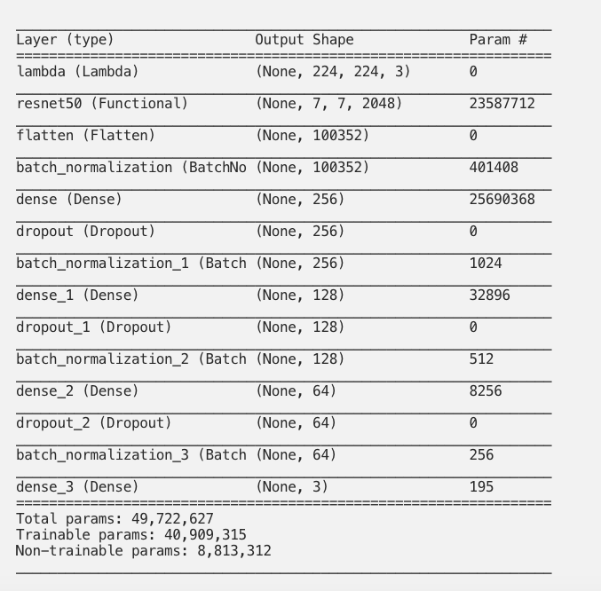

# COVID-19: Lung CT scan images detection using ResNet50.
This is my new project on COVID-19 detection in lung CT scan images. It is a tool that can help radiologists diagnose, with an accuracy up to 98%, COVID cases during an outbreak.
> Medium Article [_here_](https://bacemtayeb.medium.com/covid-19-lung-ct-scan-detection-c7998b49266b). <!-- If you have the project hosted somewhere, include the link here. -->

## Table of contents
* [General info](#general-info)
* [Technologies](#technologies)
* [Setup](#setup)

## General info
The idea is to use a deep learning model to filter the potential COVID cases immediately after the CT scan results. 
The deep learning model is a pretrained ResNet50 base model fine tuned on a large CT scan slices dataset. 
The Radiologists role would still be as important as before but this time their effort will be more focused on the cases predicted as positive and with higher confidence level (model’s output). 
In addition, the application utilizes fewer computational resources which will be suitable for third world countries’ hospitals that lack those powerful resources.
The model has been deployed on a raspberry pi 3 and achieved great results within a very short amount of time. Such results are promising especially when we consider the limited specifications of this device and its cheap price. Finally, by providing radiologists with a tool that can rapidly and accurately classify CT scans, we limit the virus’ propagation at an early stage and save efforts during an outbreak.
	
## Technologies
- The dataset used to train the model consists of data curated from 7 public datasets listed in the references. These datasets were used in previous projects related to COVID-19 diagnosis and have proven their efficiency.
- ResNet50 is one of the most popular pre-trained transfer learning-based CNN models proposed in 2015 by a group of Microsoft researchers. Its architecture consists of 5 stages each with a convolution and Identity block. Each convolution block has 3 convolution layers and each identity block also has 3 convolution layers. The ResNet-50 has over 23 million trainable parameters.
- The network can take an input according to the format HEIGHT X WIDTH X 3. Where height and width values must be 224 X 224 and the 3 refers to the number of channels in an RGB image. In addition, we used dropout technique to avoid overfitting and batch normalization to stabilize and speed up the learning process.

	
## Setup
To use this project, you can upload the streamlit.py file on the streamlit sharing plateforme or on your own server. You can also use the pretrained model directly in your application.

## Contact
Created by [@bacemetteib](https://bacemtayeb.medium.com/) - feel free to contact me!
